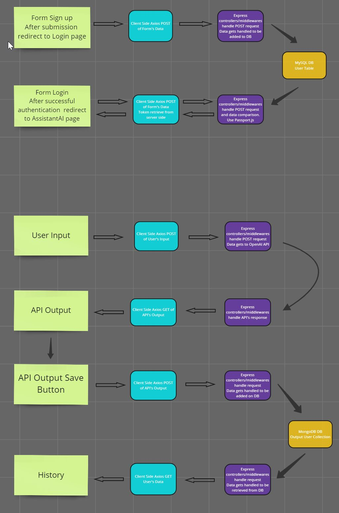

# Table of Contents
+ [Project Title](#project-title)
   + [Overview](#overview)
      + [Problem](#problem)
      + [User Profile](#user-profile)
      + [Features](#features)
   + [Implementation](#implementation)
      + [Tech Stack](#tech-stack) 
      + [APIs](#apis)
      + [Sitemap](#sitemap)
      + [Mockups](#mockups)
      + [Data](#data)
      + [Endpoints](#endpoints)
      + [Auth](#auth)
   + [Roadmap](#roadmap)
   + [Nice-to-have](#nice-to-have)

# Project Title

AI Immigration Helper 

## Overview

This app is an Artificial Intelligence assistant for Canadian immigration legal process preparation facilitating and making faster that endeavor. It also works as an educational source on how to efficiently go through the learning of Canadian immigration processes.

### Problem

Canada, and our city Vancouver, are built of immigrants and the number of new immigrants every year is high. Many, even when they are here, still need to do immigration processes for their status in Canada or to help family members.

They face a long search, organization, and document collection to do those immigration processes, many times even without understanding well English/French, or the technical words, or the technicalities required in those immigration processes; all this at the same time where they are working or adapting to their new Canadian context!

My Cuban friend passed for this, and I want to help people like him in the future and myself if in the future I need to do any process.

Considering all this, here is a list of benefits that this app could provide:

_Simplify, speed up, and make more effective the immigration process preparation:_
   + **Users can rapidly obtain overall information on how certain Canadian immigration processes work** (even up-to-date processes because the OpenAI API version that I want to use for the project can currently search the internet)

   + **Can diminish the language barrier** for properly understanding the processes: users can input in their languages and can request the answer in their languages as well.
   + **Help to speed the understanding of more complicated technical documents and information:** if users have documentation that they don't clearly understand (for the technical words and because of the language barrier) it can be uploaded as input, and they can obtain a summary of the main ideas on English/French or in their language.
   + **If authenticated users can save the data that find relevant**, and they can access it anytime. They can filter all this information that they obtain and decide what is the most relevant for them and download it as a document.

_We have an educational goal not only informational:_
   + The website will have also a page with **information on best practices on how to search the Canada Government Immigration Website to improve internet literacy** considering that even when the user can use this assistance app they need to go to that page as the reference and confirmation page.  Also, better they understand how the Canadian Government Immigration Website works more efficiently they can use this assistance app.
   + That same page will have a section that will have **links to other educational sites that could be relevant:  citizenship study, language study link page.**  This will include BrainStation deployed alumni-relevant apps -as a way to promote awesome related works from fellow past students- after they agree to this and not BrainStation-relevant apps.

_Makes the stressful and draining immigration process a bit less daunting and more connected:_

  + **The gpt will be customized to have a casual (but informative) way to communicate** to try to engage/connect more with the audience on an already stressful topic for many users. 

  + Having information from the Internet is many times, not enough to dissipate doubts and insecurities about our immigration processes. Considering that **I would like to add a section on the Educational page on the app where users can select immigration advisors’ offices where they can have that necessary face-to-face human interaction**. The app facilitates this process by adding Google Maps API making sure that after the users select what office want to go to, they will get the location, how to get there, and contact info of the advisor office website.  I would like to add also the languages that are spoken by the advisors in those offices other than English and French because if users find advice in their languages and maybe from someone with a similar cultural background may improve the connection feeling, the understanding of the process and reduce stress. ***This will be a benefit as a result of a nice-to-have feature.***

### User Profile

This app is created for anyone in Vancouver facing Canadian immigration processes but most likely new immigrants or those trying to help family members with Canadian immigration processes. Part of the audience may not be computer/internet savvy so the app should prioritize simplicity.

### Features

User possibility to sign up/log in. When the user submits his sign-up data, it gets redirected to the login page and after successful authentication, it will be redirected to the page with the AI assistant. If the user chooses to authenticate with the Third-Party Authentication System, it will be redirected to the AI Assistant page after successful authentication.

On the AI Assistant page, users can create input by texting or uploading a document, and by specifying a whole range of settings that they can specify on their prompts to obtain an output that is a better fit for their needs. Prompts like the language of response, length of the response, summarization, and key points creation.

On the same page, the app will give back output based on the user input and the casual but informative tone set on the server for the output. It is important to mention that the output will be set to avoid answering inappropriate questions. If the user is authenticated can save this output.

On the same page, if the user is authenticated can have access to the history of all his input by date. It can see the history by date, it can filter this information and it can also download it as a document.

Users can go to the Educational Page where they will obtain best practices information on how to search on, pass through, and better understand the Canadian immigration website and other official websites and sources of information with similar purposes.

On the same page, users will find links to website sources with educational purposes that could be relevant to the population sector that most frequently needs to do immigration processes: immigrants. Websites linked could be about English language learning and citizenship study preparation.

## Implementation

**Functionality Diagram**

### Tech Stack

I will be using the MERN stack as the core and adding technologies on top of that.

+ Styling: Sass 

 + Client-Side functionality: React.js, Axios library  

+ Server-side functionality:  Node.js, Express.js  

+ Database: MySQL (SQL), MongoDB (NoSQL), Knex.js (query builder), Mongoose (ODM)  

+ Authentication: Passport.js  

+ External APIs: OpenAI API, Google Map API (under nice to have) 

### APIs

I will be using OpenAI API to generate output/answers to users requesting inputs.

### Sitemap

***Home Page***

It will be the landing page, the first page that the user will have contact with.  It will have a hero section with an image and a short sentence/title descriptive of what this app is about.  Have a description section with 2 or 3 paragraphs about why this project and how can it be useful for users. Have another section where some sort of animation or image or something engaging in general and with a button that will connect to the AI Assistance page.

***Signup Page***

The signup page will have a signup form for user registration.

***Login Page***

The login page will have a login form for user authentication. It will also include the Google logo for the sign-up connection.

***AI Assistance Page***

This page will contain three main sections: input, output, and history. Input will look like a regular form with a text area. The spaces where the output and history return will look like text area boxes as well.

***Educational Page***

This page will contain two main sections the first with Best Practice Information with a descriptive set of paragraphs. The other section will include a list of organized links to relevant sources of educational websites (this will include BrainStation deployed alumni relevant apps and not BrainStation relevant apps). If I reach to do nice to have, I will add below an image and Immigration advisor links

**Each page will include a nav and footer component.** The nav will include the logo and the navigation bar. The footer will include ways of contacting the creator of the app, it also will repeat the disclaimer about the educational/informational process of this website and the need to always check the official Canadian government website and authorities for confirmation before taking any legal action.

### Mockups

**Home Page**

**Signup Page**

**Login Page**

**AI Assistance Page**

**Educational Page**

### Data

I will be using MySQL and MongoDB databases.

On MySQL, I will have a user table for adding the new users' information. On MongoDB I will store the OpenAI API output that authenticated users decide to save. The authenticated user will be connected to the right NoSQL data through a unique identifier.

### Endpoints

| Denomination | HTTP method |	Params	| Example Response |
|--------------|-------------|----------|------------------|
|'authent/sign-up/'|	POST |     | {id: 1, username: ‘master28’, email: testing@gmail.com, password: ‘testing28$’} |	
|'authent/login/' |  POST  |    | {email: testing@gmail.com, password: testing28$}  |
|'ai/input' | POST  |   | {input: ‘’Steps for obtaining a Canadian visitor visa”} |
|'ai/output/' |	GET  |   | {output: The steps for … (OpenAI API text generated)}|
|'ai/output/save/:id' |	POST  |  Header Parameters (this endpoint requires tokens on the header) |  {id: 1, date: 25/2/2024, output: The steps for … (OpenAI API text generated)} |
|'history/:id' | GET  |  Header Parameters (this endpoint requires tokens on the header) | [{date: 25/2/2024, output: The steps for … (OpenAI API text generated)}, {date: 26/2/2024, output: The steps for … (OpenAI API text generated)}] |
|history/:id/download |	GET  |  Header Parameters (this endpoint requires tokens on the header) | [{date: 25/2/2024, output: The steps for … (OpenAI API text generated)}, {date: 26/2/2024, output: The steps for … (OpenAI API textgenerated)}]  |

| React Routes | Related Page |
|--------------|--------------|
|‘/’| Home Page |
|‘/signup’|	Signup Page |
|‘/login’  |	Login Page |
|‘/aiassistance’ |	AI Assistance Page |
|‘/educational’	| Educational Page |

### Auth

The app will include JSON Web Token Authentication as well as OAuth 2.0 with Google.

***JSON Web Token Authentication*** 

Using the Passport.js library as middleware on the Node.js/Express.js app
It will include a sign-up page that will collect to the MySQL database-relevant data from the user. Then the user will be redirected to a log-in page where authentication credentials will be checked -form validation included- to authenticate and obtain a JSON web token for access to those app functionalities that require it.

***Oauth 2.0 with Google***

Using the Passport.js library as middleware on the Node.js/Express.js app
It will include the Google logo for sign-up connection on the same page as the login form.

***App functionalities that require authentication:***

  + Save the GPT output data.
  + Recover the user history and all the features that came with it like filtering and downloading this user history information.

## Roadmap

**Sprint 1 Tasks**

Estimated time: 15h

_Creating the React app Functional Component and Pages with the basic structure and basic layout styling._

  + Create Git local repo main and three sprints’ branches.
  + Add React Router and organize pages and components inside pages.
  + Add a basic layout styling following the mockups.
  + Organize the folder structure tree following best practices.

_Create an Express app with the basic structure of the folder and the functionalities for storing data in the Database._

  + Create Git local repo main and three sprints’ branches.
  + Create an express app and organize the folder following best practices and convenience: this  includes folders for Routes, Models, and Controllers files. Organize the import/export flow conveniently.
  +	Add the necessary drives to use MySQL and MongoDB databases.
  +	On the folder for models (database tables information) create files where you define a connection with MySQL Database and create tables according with design. Use Knex.js for this.  
  +	On the same folder create a connection with MongoDB using Mongoose

**Sprint 2 Tasks**

Estimated time: 30h.

_Adding frontend needed functionality._ 

  + Setting necessary props, hooks (tentatively will be useState, useEffect, useParams), and event listeners.
  +	Connecting Axios on JSX and with the right endpoints for data transmission between front and backend
  + Test all endpoint functionalities.

_Connecting necessary middlewares and controllers for adding OpenAI API and Passport.js for authentication_

  +	Add all the routes on the route folder based on the different endpoints, different methods, and expected functionalities. 
  +	Setting the configuration for use OpenAI API including the necessary output settings that adjust to my app goals. This means: 

       A.	connecting with the API

       B.	adding my private key variable (I will use an environmental variable)

       C.	adding configuration details

       D.	set that the information came from a certain endpoint.

       E.	set that the output will be delivered in another defined endpoint.

  +	Setting the Passport.js. In the case of JWT authentication connects with the database-relevant model.
  +	Connecting the MySQL user model key entry with an entry in MongoDB for setting the history functionality 

**Sprint 3 Tasks**

Estimated time: 35 h.

_Add the styling details._

  + Improve the layout and add responsiveness with an approach of mobile-first. Set the right proportion between elements according to mockups.
  + Add styles related to the different backgrounds and colors.
  + Add styles related to texts.
  + Add animation and other necessary visual effects.

_Add the necessary search and download/upload capabilities whenever necessary on the website._

  + Add filtering by keyword with React. 
  +	Add filtering with Express an amount of entry of 3 last one every time the user clicks the show history button. If it clicks again, it will obtain the three last after that.
  +	File upload/download will involve server-side and client-side apps.

_Organize settings, environmental variables, and general codebase for deployment._

  +	Use Cors express middleware to establish communication between the React and Express apps once deployed.
  +	Do the necessary configuration changes.
  +	Follow the deployment steps for the React app on Netlify, adding the Express app deployed URL as the backend URL. I will try to set it with HTTP to improve security.
  +	For deploying the Express app, I will use Web Hosting Canada.

**Sprint 4 Tasks- Under will be nice to have.**

_Adding the functionality related to immigration advisor offices in the city that connect with Google Map_
  +	Adding all the styling and information for this new section
  + Setting the configuration for use of the Google Map API. This means: 

      A.	connecting with the API

      B.	adding my private key variable (I will use an environmental variable)

      C.	adding configuration details

      D.	set that the information came from a certain endpoint when a clicking event happens over one of the immigration advisor office images/cards, particularly the address information is the one being used to make the automatic Google Map search.

## Nice-to-have

Adding that extra section on the Educational Page where users can select immigration advisors’ offices where they can have that necessary face-to-face human interaction will be nice to have:
On the same educational page users can see a list of images/cards with information - including contact information and language that could be spoken in that office other than English/French - about different immigration advisor offices. 

If the user clicks on one of the Links it will be redirected to Google Maps where he can observe where the office is located and ways to get there
